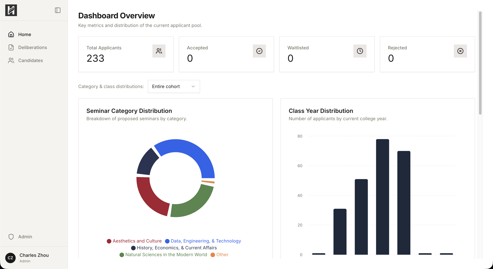
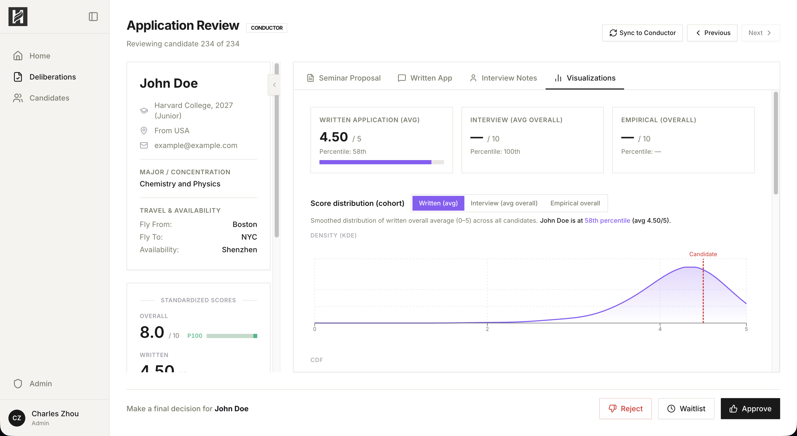

## HSYLC Deliberations Data Commands

| Dashboard | Delib |
|-----------|-------|
|  |  |

All commands are run from this directory (`hauscr-hsylc/`).  
Supabase credentials are read from `frontend/.env` (`SUPABASE_URL`, `SUPABASE_KEY`).

### Update candidates from written applications

Inputs:
- `../sheets/Written.csv`

Commands:

```bash
python3 preprocess_written.py
python3 upload_candidates.py
```

### Update interviews

Input:
- `../sheets/Interviews.csv`

Commands:

```bash
python3 upload_interviews.py --truncate
```

